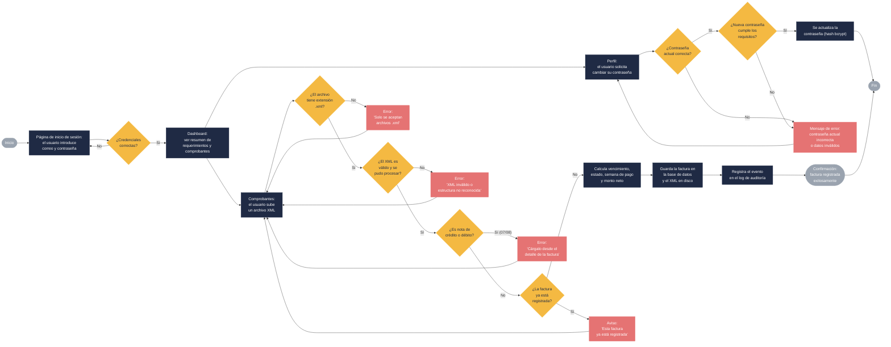

```mermaid
flowchart LR
    Inicio([Inicio])
    Login["Página de inicio de sesión:<br/>el usuario introduce<br/>correo y contraseña"]
    CredOK{"¿Credenciales<br/>correctas?"}
    Dashboard["Dashboard:<br/>ver resumen de<br/>requerimientos y comprobantes"]

    PerfilCambiarPass["Perfil:<br/>el usuario solicita<br/>cambiar su contraseña"]
    PassActualOK{"¿Contraseña<br/>actual correcta?"}
    NuevaPassOK{"¿Nueva contraseña<br/>cumple los<br/>requisitos?"}
    GuardarPass["Se actualiza la<br/>contraseña (hash bcrypt)"]
    ErrorPass["Mensaje de error:<br/>contraseña actual incorrecta<br/>o datos inválidos"]

    SubirXML["Comprobantes:<br/>el usuario sube<br/>un archivo XML"]
    ExtOK{"¿El archivo<br/>tiene extensión<br/>.xml?"}
    ParseOK{"¿El XML es<br/>válido y se<br/>pudo procesar?"}
    TipoDoc{"¿Es nota de<br/>crédito o débito?"}
    Duplicado{"¿La factura<br/>ya está<br/>registrada?"}
    Calcular["Calcula vencimiento,<br/>estado, semana de pago<br/>y monto neto"]
    Guardar["Guarda la factura en<br/>la base de datos<br/>y el XML en disco"]
    Auditoria["Registra el evento<br/>en el log de auditoría"]
    Confirmacion(["Confirmación:<br/>factura registrada<br/>exitosamente"])

    ErrorExt["Error:<br/>'Solo se aceptan<br/>archivos .xml'"]
    ErrorParse["Error:<br/>'XML inválido o<br/>estructura no reconocida'"]
    ErrorTipo["Error:<br/>'Cárgalo desde el<br/>detalle de la factura'"]
    ErrorDuplicado["Aviso:<br/>'Esta factura<br/>ya está registrada'"]

    Fin([Fin])

    Inicio --> Login --> CredOK
    CredOK -- No --> Login
    CredOK -- Sí --> Dashboard

    Dashboard --> PerfilCambiarPass --> PassActualOK
    PassActualOK -- No --> ErrorPass --> PerfilCambiarPass
    PassActualOK -- Sí --> NuevaPassOK
    NuevaPassOK -- No --> ErrorPass
    NuevaPassOK -- Sí --> GuardarPass --> Fin

    Dashboard --> SubirXML --> ExtOK
    ExtOK -- No --> ErrorExt --> SubirXML
    ExtOK -- Sí --> ParseOK
    ParseOK -- No --> ErrorParse --> SubirXML
    ParseOK -- Sí --> TipoDoc
    TipoDoc -- "Sí (07/08)" --> ErrorTipo --> SubirXML
    TipoDoc -- No --> Duplicado
    Duplicado -- Sí --> ErrorDuplicado --> SubirXML
    Duplicado -- No --> Calcular --> Guardar --> Auditoria --> Confirmacion --> Fin

    classDef proceso fill:#1f2a44,color:#fff,stroke:#1f2a44
    classDef decision fill:#f4b942,color:#1f2a44,stroke:#f4b942
    classDef terminal fill:#9aa3af,color:#fff,stroke:#9aa3af
    classDef error fill:#e57373,color:#fff,stroke:#e57373
    classDef ok fill:#1f2a44,color:#fff,stroke:#1f2a44

    class Inicio,Fin,Confirmacion terminal
    class Login,Dashboard,PerfilCambiarPass,GuardarPass,SubirXML,Calcular,Guardar,Auditoria proceso
    class CredOK,PassActualOK,NuevaPassOK,ExtOK,ParseOK,TipoDoc,Duplicado decision
    class ErrorPass,ErrorExt,ErrorParse,ErrorTipo,ErrorDuplicado error
```
